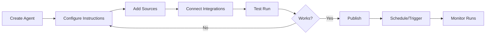

## Overview

Decisional is built around a few core concepts that work together to automate your business workflows. Understanding these concepts will help you get the most out of the platform.

<CardGroup cols={2}>
  <Card title="Agents" icon="robot">
    Autonomous AI workers that execute your workflows
  </Card>
  <Card title="Worksheets" icon="table">
    Your data layer - spreadsheets where agents read and write
  </Card>
  <Card title="Sources" icon="folder-open">
    Context for your agents (PDFs, documents, links)
  </Card>
  <Card title="Runs" icon="play">
    Executions of your agent workflows
  </Card>
  <Card title="Integrations" icon="plug">
    Connected services (CRM, email, databases)
  </Card>
  <Card title="Workspaces" icon="users">
    Team collaboration and organization
  </Card>
</CardGroup>

---

## Agents

**Agents are autonomous AI workers** that understand instructions, process documents, and complete tasks.

### What Makes an Agent?

<AccordionGroup>
  <Accordion title="Instructions" icon="file-lines">
    Natural language description of what the agent should do. Write instructions like you're training a new team member.

    **Example:**
    ```
    You are an Invoice Processing Agent.
    Review uploaded invoices, extract key information,
    and update the tracking spreadsheet.
    ```
  </Accordion>

  <Accordion title="Worksheet" icon="table-cells">
    The spreadsheet where your agent reads input data and writes results.
  </Accordion>

  <Accordion title="Sources" icon="folder">
    Documents that provide context:
    - PDFs (contracts, invoices, forms)
    - CSVs (price lists, templates)
    - Web links (documentation, APIs)
  </Accordion>

  <Accordion title="Integrations" icon="link">
    Connected services the agent can interact with:
    - Send emails (Gmail, Outlook)
    - Update CRM (HubSpot, Salesforce)
    - Post to Slack
    - Query databases
  </Accordion>

  <Accordion title="Triggers" icon="clock">
    How the agent gets activated:
    - **Time-based**: Every day at 9 AM
    - **Event-based**: When new data arrives
    - **Manual**: Click "Run" button
  </Accordion>
</AccordionGroup>

### Agent Lifecycle



---

## Worksheets

**Worksheets are your data layer** - they're spreadsheets where your agents read input and write output.

### Key Features

<CardGroup cols={2}>
  <Card title="Familiar Interface" icon="table">
    Full-featured spreadsheet editor (powered by SpreadJS)
  </Card>
  <Card title="Formulas & Functions" icon="function">
    All standard Excel formulas work
  </Card>
  <Card title="Charts & Viz" icon="chart-line">
    Create visualizations of your data
  </Card>
  <Card title="Auto-Save" icon="floppy-disk">
    Changes sync automatically
  </Card>
</CardGroup>

### Supported Formats

- **CSV**: Simple comma-separated values
- **XLSX**: Excel workbooks (multiple sheets)
- **XLS**: Legacy Excel format
- **Google Sheets**: Import directly (coming soon)

<Tip>
  **Pro Tip:** Structure your worksheet with clear column headers. This helps agents understand your data better.
</Tip>

### Example Worksheet Structure

| Quote ID | Date | Customer | Product | Quantity | Unit Price | Total | Status |
|----------|------|----------|---------|----------|------------|-------|--------|
| Q-001 | 2025-01-15 | Acme Corp | Widget A | 10 | $50 | $500 | Sent |
| Q-002 | 2025-01-16 | TechCo | Widget B | 5 | $100 | $500 | Draft |

---

## Sources

**Sources provide context** to your agents so they can make informed decisions.

### Types of Sources

<Tabs>
  <Tab title="Documents">
    Upload files for your agent to reference:

    - **PDFs**: Contracts, invoices, forms, statements
    - **Word Docs**: Policies, templates, procedures
    - **Excel**: Historical data, price lists, catalogs
    - **Images**: Forms, receipts (with OCR)

    **Example use case:**
    Upload past quotes so your agent can match the style and formatting.
  </Tab>

  <Tab title="Web Links">
    Add URLs for your agent to monitor or reference:

    - Company websites
    - Documentation pages
    - API endpoints
    - News sources

    **Example use case:**
    Monitor competitor pricing pages to keep your quotes competitive.
  </Tab>

  <Tab title="Integrations">
    Connect live data sources:

    - CRM records (HubSpot, Salesforce)
    - Email threads (Gmail, Outlook)
    - Database queries (PostgreSQL, Snowflake)
    - File storage (Google Drive, OneDrive)

    **Example use case:**
    Pull customer data from Salesforce to personalize quotes.
  </Tab>
</Tabs>

### How Agents Use Sources

Decisional uses **Retrieval-Augmented Generation (RAG)** to help agents understand your documents:

1. **Indexing**: Documents are processed and indexed
2. **Retrieval**: When needed, relevant sections are retrieved
3. **Citation**: Agents cite specific pages/sections they reference
4. **Bounding Boxes**: Exact locations in PDFs are highlighted

<Check>
  Your agent can understand and reference thousands of pages of documentation!
</Check>

---

## Runs

**Runs are executions of your agent workflow**. Each time your agent performs its task, that's a run.

### Run Status

<ResponseField name="Running" type="status" color="blue">
  Agent is currently executing the workflow
</ResponseField>

<ResponseField name="Completed" type="status" color="green">
  Workflow finished successfully
</ResponseField>

<ResponseField name="Failed" type="status" color="red">
  Workflow encountered an error
</ResponseField>

<ResponseField name="Needs Review" type="status" color="yellow">
  Agent needs human approval to proceed
</ResponseField>

### What's in a Run?

Every run includes:

- **Start Time**: When it began
- **Duration**: How long it took
- **Inputs**: Data the agent received
- **Outputs**: Results the agent produced
- **Logs**: Detailed execution trace
- **AI Reasoning**: Agent's thought process

### Monitoring Runs

View run history in the **Runs** tab:

- Filter by status, date range
- See activity charts and trends
- Click any run for detailed logs
- Retry failed runs
- Cancel running workflows

---

## Integrations

**Integrations connect external services** to your agents.

### Available Integrations

<CardGroup cols={3}>
  <Card title="Email" icon="envelope">
    Gmail, Outlook, SMTP
  </Card>
  <Card title="CRM" icon="address-book">
    HubSpot, Salesforce, Attio
  </Card>
  <Card title="Calendar" icon="calendar">
    Google Calendar, Outlook
  </Card>
  <Card title="Storage" icon="hard-drive">
    Google Drive, OneDrive, S3
  </Card>
  <Card title="Communication" icon="message">
    Slack, Microsoft Teams
  </Card>
  <Card title="Databases" icon="database">
    PostgreSQL, MySQL, Snowflake
  </Card>
  <Card title="Payments" icon="credit-card">
    Stripe, Bill.com
  </Card>
  <Card title="APIs" icon="code">
    Custom webhooks, REST APIs
  </Card>
  <Card title="More" icon="ellipsis">
    And many more...
  </Card>
</CardGroup>

### Using Integrations

1. **Connect**: Authorize the integration in your workspace
2. **Reference**: Mention it in agent instructions
3. **Trigger**: Set up event-based triggers
4. **Act**: Agent can read from and write to the service

<Warning>
  Integrations can be shared across your workspace or kept private to specific agents.
</Warning>

---

## Workspaces

**Workspaces organize your team and agents**.

### What's a Workspace?

A workspace is a container for:
- Agents
- Worksheets
- Sources
- Integrations
- Team members

### Workspace Roles

| Role | Create | Edit | Run | Invite | Delete |
|------|--------|------|-----|--------|--------|
| **Owner** | ✅ | ✅ | ✅ | ✅ | ✅ |
| **Admin** | ✅ | ✅ | ✅ | ✅ | ❌ |
| **Editor** | ✅ | ✅ | ✅ | ❌ | ❌ |
| **Viewer** | ❌ | ❌ | ✅ | ❌ | ❌ |

### Organizations

If you sign up with a **company email** (not Gmail, Yahoo, etc.), you'll automatically join your organization's workspace.

Example:
- `john@acme.com` → Joins "Acme" organization
- `sarah@gmail.com` → Creates personal workspace

---

## How It All Works Together

Here's how these concepts combine in a real workflow:

<Steps>
  <Step title="Create Agent">
    You create a "Quote Generation Agent" in your **Workspace**
  </Step>

  <Step title="Upload Worksheet">
    Upload a price list **Worksheet** (Excel file)
  </Step>

  <Step title="Add Sources">
    Upload past quotes (PDFs) as **Sources** for reference
  </Step>

  <Step title="Connect Integration">
    Connect Gmail **Integration** to send quotes
  </Step>

  <Step title="Write Instructions">
    Tell the **Agent** how to generate quotes
  </Step>

  <Step title="Set Trigger">
    Configure to run daily or when new requests arrive
  </Step>

  <Step title="Monitor Runs">
    Check **Runs** tab to see execution history
  </Step>
</Steps>

---

## Next Steps

<CardGroup cols={2}>
  <Card title="Quickstart" icon="rocket" href="/quickstart">
    Build your first agent in 5 minutes
  </Card>

  <Card title="Working with Agents" icon="robot" href="/guides/agents">
    Deep dive into agent configuration
  </Card>

  <Card title="Workflow Tutorials" icon="graduation-cap" href="/workflows/finance/quote-generation">
    Step-by-step guides for common workflows
  </Card>

  <Card title="API Reference" icon="code" href="/api-reference/introduction">
    Programmatic access to Decisional
  </Card>
</CardGroup>
