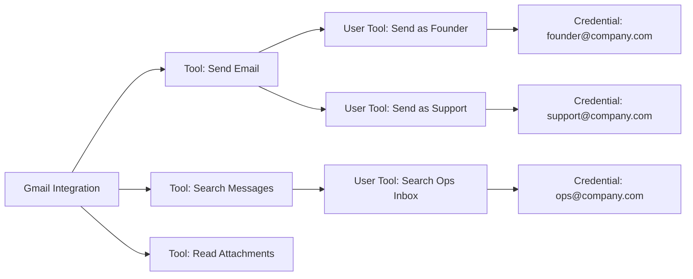

## What Are Credentials?

Credentials are the authorized accounts, tokens, or keys Decisional uses when an agent calls an external system.

They sit underneath integrations, tools, and user tool bindings:

| Concept | Meaning |
|---------|---------|
| **Integration** | The external system or toolkit, such as email, team chat, CRM, file storage, or a database |
| **Tool** | A specific capability inside that integration, such as send email, list files, update a CRM record, or post a message |
| **Credential** | The authorized account, token, API key, or connection a tool uses to perform the action |
| **User Tool** | The binding between a tool and a credential, with a display name, optional defaults, and active or pending connection state |

An integration can expose many tools. A tool can use multiple credentials when your workspace has more than one authorized account for the same capability.

For example, a Gmail integration can include tools for sending email, searching messages, and reading attachments. The send-email tool might be able to use a founder's account, a support inbox, or a shared operations inbox, depending on which credentials are connected and allowed.

In this example, the same Gmail integration exposes multiple tools. The same send-email tool is usable through more than one User Tool because each binding points at a different credential.

## Credential Types

Decisional supports a few credential patterns:

| Type | What it is used for |
|------|---------------------|
| **Connected account** | OAuth or account-based authorization for an integration account |
| **Manual credential** | API keys, basic auth, database credentials, or custom integration secrets entered through a credential form |
| **Platform credential** | A Decisional-managed credential for supported tools, metered through credits instead of using your own connected account |

Credentials have connection status:

| Status | Meaning |
|--------|---------|
| **Active** | The credential is usable and can be bound to tools |
| **Expired** | The credential needs to be refreshed or replaced before tools can run |
| **Initiated** | The connection flow started but has not completed yet |

Only active credentials are offered when choosing a credential for a tool.

## How Tools Use Credentials

When an agent runs a workflow step that calls an integration tool, Decisional resolves three things:

1. **The integration** the workflow is using
2. **The tool** needed for that step
3. **The credential** allowed to execute that tool

The selected credential determines which external account the action happens through. This is why credential labels and workspace sharing matter: teams often connect multiple accounts for the same integration, and the agent needs to use the right one.

### User Tool Bindings

Decisional stores the exact tool-to-credential pairing as a User Tool. A User Tool can be:

- Bound to a specific integration credential
- Bound to a platform credential when the integration supports it
- Pending when the tool exists but no credential has been connected yet

User Tools can also carry default parameters. Defaults are useful when a tool should usually run with the same account, folder, channel, database, recipient, or other option.

### Multiple Credentials for One Tool

A single tool can be used with different credentials. For example, the same send-message tool can be bound to a support credential, an operations credential, or a personal credential.

In the app, credentials are shown with labels and account identifiers so builders can choose the correct account. If no label is set, Decisional falls back to the account identifier when available.

## Credential Sharing

Credential visibility depends on the workspace.

| Workspace type | Credential behavior |
|----------------|---------------------|
| **Personal Workspace** | Credentials are private to the user. Integrations connected here are not usable by other people. |
| **Shared workspace** | Credentials can be shared with the workspace so multiple people and agents can use approved accounts. |

Credentials are still governed by access controls. Sharing a credential does not mean every action is allowed automatically.

Credential ownership still matters:

- The owner can rename, refresh, update, delete, and change sharing for their credential.
- Other workspace members can use shared credentials when policy allows, but they do not own the secret.
- Public or unauthenticated views only receive sanitized connection state. They do not expose internal credential IDs or secret values.

## Access Control Policy

Decisional applies policy at the integration and tool level.

Policy controls:

- Which integrations are available in a workspace
- Which tools are allowed for an agent or workflow
- Which credentials a tool can use
- Whether a tool can run automatically, must ask for approval, can bypass eligible approvals, or is blocked

This lets a team allow read-only tools broadly while keeping sensitive write tools, external sends, record updates, or destructive actions behind stricter controls.

Tools also carry an access type:

| Access type | Typical use |
|-------------|-------------|
| **Read** | Search, list, fetch, inspect, summarize, or retrieve data |
| **Write** | Send, create, update, delete, publish, comment, or otherwise change an external system |

Read tools are usually safer to make broadly available. Write tools should be reviewed more carefully because they can affect customers, records, files, or other systems.

<Card title="Approvals and Policy" icon="user-check" href="/agents/approvals">
  Learn how tool policy combines with agent approval settings and workflow gates.
</Card>

## Security Model

Agent code does not receive raw credential values. Decisional resolves the tool and credential server-side, executes the external call through the credential service, and keeps secrets out of agent-visible state.

The execution path is:

1. The workflow calls a User Tool by ID.
2. Decisional resolves the integration, tool, provider, defaults, and credential binding.
3. The credential service decrypts or resolves the credential only for that outbound call.
4. The provider adapter executes the action against the external system.
5. The agent receives the result, not the secret.

Sensitive credential fields are omitted from API responses and logs. Credential material is encrypted at rest and decrypted only in memory during execution.

<Card title="Security" icon="shield" href="/security">
  Learn how Decisional protects credentials and workspace-scoped access.
</Card>
